# 🧠 Jogo da Memória com PIC18F4520 

Um projeto interativo de jogo da memória desenvolvido com o microcontrolador **PIC18F4520**, usando **MPLAB X IDE + XC8** e simulado na **placa McLab2 do PicSimLab**.

---

## 🎯 Objetivo

Criar um jogo da memória eletrônico com:

-  **LEDs coloridos**
-  **Botões de entrada**
-  **Display de 7 segmentos**
- **Músicas com buzzer** 
-  **Sensor LDR para iniciar o jogo**

---

## ⚙️ Plataforma e Ferramentas

-  **Microcontrolador:** PIC18F4520  
-  **IDE:** MPLAB X IDE  
-  **Compilador:** XC8  
-  **Simulador:** PicSimLab – Placa McLab2

---

## 🕹️ Funcionamento do Jogo

### 1. Início

- O sistema fica em **modo de espera**.
- O jogo inicia **automaticamente** quando o **sensor LDR detectar pouca luz** (ex: cobrindo o sensor).

### 2. Rodada do Jogo

- O microcontrolador gera uma **sequência aleatória** de LEDs, aumentando a dificuldade a cada nível.
- O jogador deve **memorizar e repetir** a sequência com os **botões RB0 a RB3**:
  - 🟢 RB0: Verde  
  - 🔴 RB1: Vermelho  
  - 🔵 RB2: Azul  
  - 🟡 RB3: Amarelo
- O sistema **valida a entrada** após cada botão pressionado.

### 3. Validação

- **Acertou:**  
  - Nível aumenta  
  - Display de 7 segmentos atualiza  
  - Nova sequência mais longa 

- **Errou:**  
  - Toca som de erro no buzzer   
  - Reinicia o jogo para o **nível 0**   

### 4. Final do Jogo

- O jogo termina quando o jogador completa o **Nível 9** com sucesso.
- O jogo reinicia automaticamente para uma nova rodada.

---

## 🔌 Componentes Utilizados

| Componente             | Descrição                                      |
|------------------------|-----------------------------------------------|
| 🧠 PIC18F4520           | Microcontrolador principal                    |
| 🟢🔴🔵🟡 LEDs             | Saída visual (RD0 a RD3)                      |
| 🎮 Botões (RB0–RB3)    | Entrada do jogador                            |
| 🔢 Display 7 segmentos | Mostra o nível/pontuação (0 a 9)              |
| 🔊 Buzzer              | Música de erro e vitória                      |
| 🎚️ Potenciômetro       | Controle de volume do buzzer                  |
| 🌑 Sensor LDR          | Gatilho de início com baixa luminosidade      |

---


## Imagens e GIFs do Projeto

### 🎮 Simulação no PicSimLab

*Elementos utilizados*  
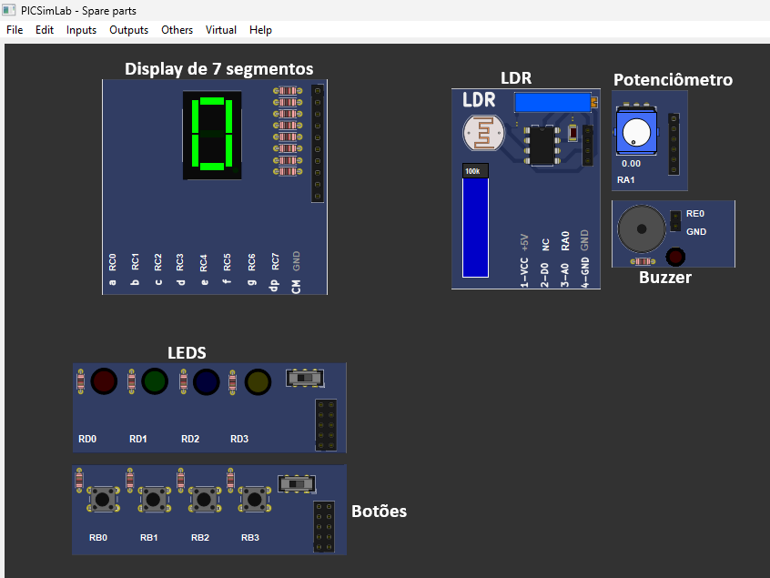

*Início do jogo ao cobrir o sensor LDR*  
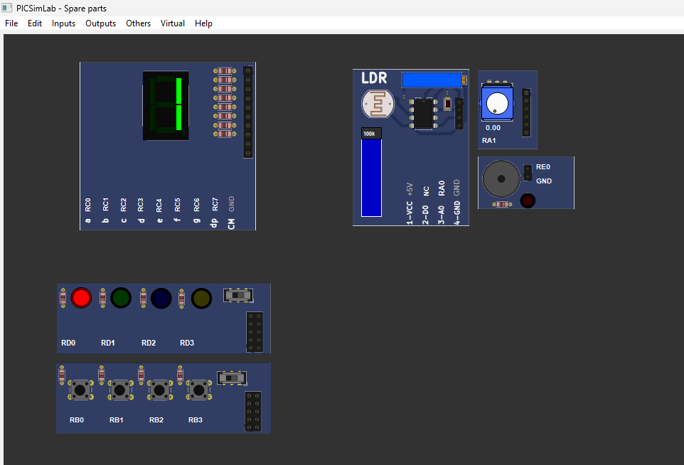

*Sequência gerada até o nível 4*  
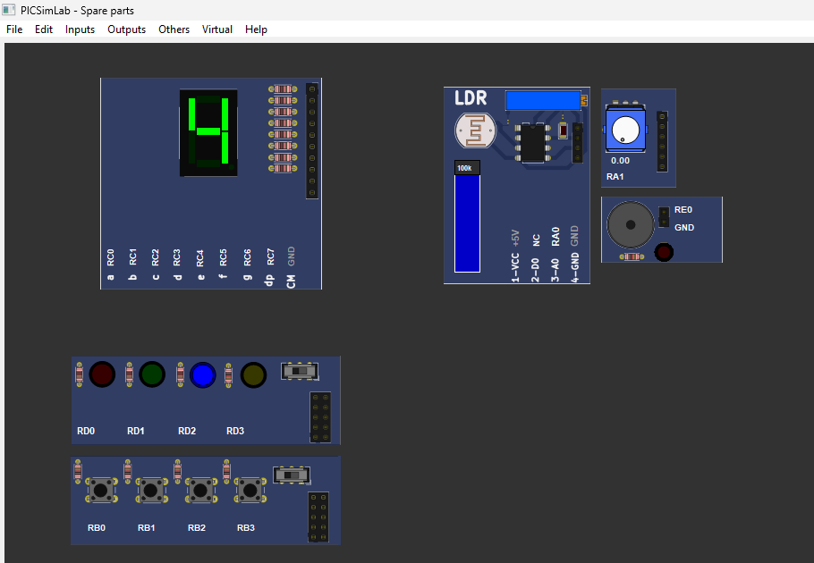

---

### ⚙️ Configurações do Projeto

*Conexão e uso do display para mostrar a pontuação*  
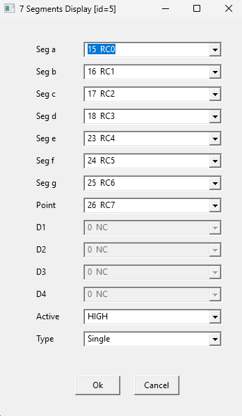

*LEDs conectados aos pinos RD0–RD3*  
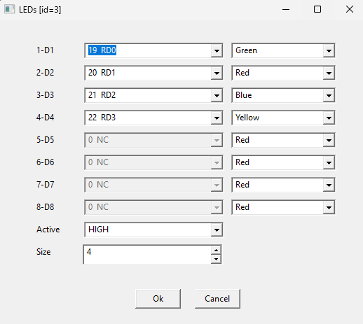

*Botões conectados aos pinos RB0–RB3*  
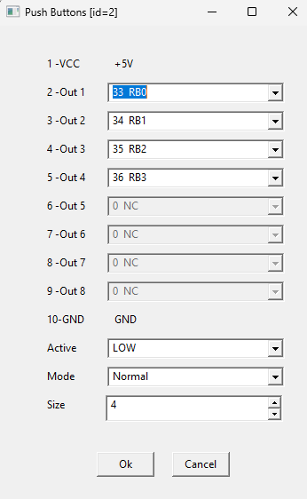

*Buzzer para som de erro e vitória*  
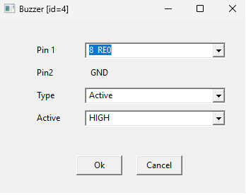

*Volume do buzzer ajustado por potenciômetro*  
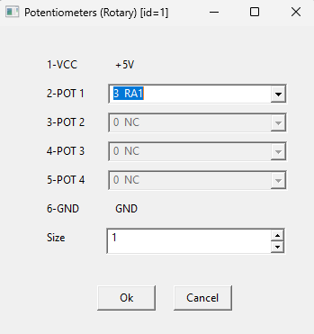

*LDR utilizado para iniciar o jogo*  
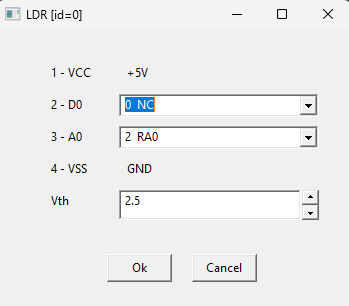

---

### 🌀 Animações (GIFs)

*Visualização da placa*  
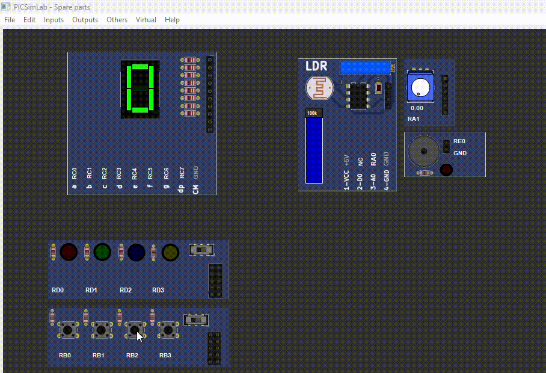

*Display de 7 segmentos aumentando a pontuação após resposta correta*  
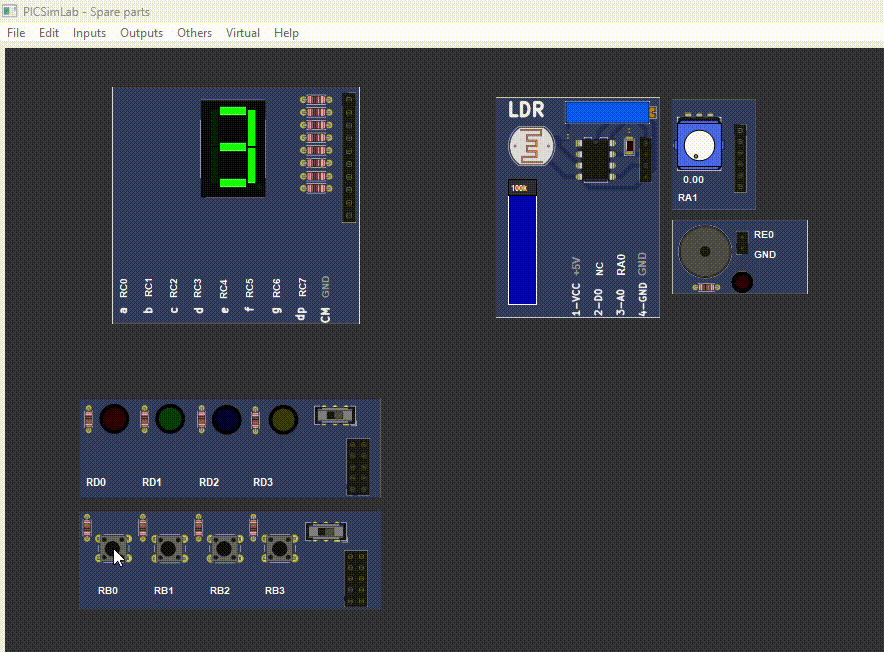

## 🚀 Como executar

1. Clone esse repositório:

```bash
git clone https://github.com/CarolineGrizante/MemoryGame-PIC18F4520.git
